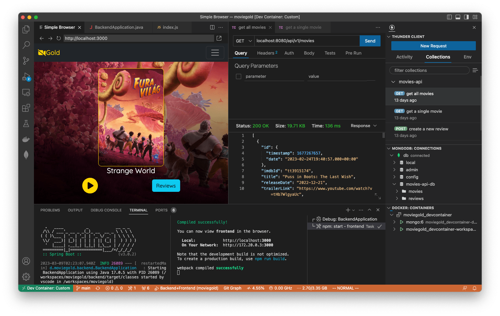

# MovieGold

A full-stack movie review app with a backend in Java (Spring Boot), a frontend in JavaScript (React), and a MongoDB database using Dev Container and Docker Compose for ease of development.



## Why Dev Container?

This project provides a one-click, ready-to-code development setup using [Dev](https://code.visualstudio.com/docs/devcontainers/containers) [Container](https://containers.dev/) technology, which can be opened using GitHub Codespaces in the cloud or using Visual Studio Code on the local machine (with Docker Desktop and Dev Containers extensions installed). When the dev container is launched, a MongoDB database service will be spun up automatically (thanks to Docker Compose). The dev container also includes an opinionated set of useful Visual Studio Code extensions. Besides, launch.json and tasks.json files are written to allow users to build and run frontend or backend servers conveniently in Visual Studio Code. Those features make development easy and avoid wasting time setting up a working, consistent dev environment.

## Technologies

-   Backend: Java, Spring Boot
-   Frontend: JavaScript, React, JSX, CSS, Node.js, ESLint, Jest
-   Database: MongoDB
-   Development: Dev Container, Docker Compose, Visual Studio Code

## Getting started

### Option 1: Using GitHub Codespaces with Dev Container

#### Development setup

On GitHub, click `Code` > `Codespaces` > `Create Codespaces on main`. Or click the badge below:

[](https://github.com/codespaces/new?hide_repo_select=true&ref=main&repo=604053198)

#### Building and running

Wait until all Visual Studio Code extensions are installed and activated. In `Run and Debug` view, select `Backend+Fronted` and press `F5` to run both the backend and frontend servers. In `Ports` panel, find `3000` and select `Open in Browser` to play with the app.

### Option 2: Using Visual Studio Code with Dev Container

#### Development setup

Install software:

1. [Visual Studio Code](https://code.visualstudio.com/) with [Dev Containers extension](https://marketplace.visualstudio.com/items?itemName=ms-vscode-remote.remote-containers)
2. [Docker Desktop](https://www.docker.com/products/docker-desktop/)

In Visual Studio Code, open the project, press `F1` to show `Command Palette`, and then type and select `Dev Containers: Open Folder in Container`.

#### Building and running

Same as the GitHub Codespaces instruction above.

### Option 3: Using any code editor without Dev Container

#### Development setup

Install software:

1. Any code editor
2. Docker Desktop
3. JDK 17
4. Node.js 18
5. MongoDB 6

#### Building and running

Start all services manually.

Database:

```bash
cd .devcontainer
docker compose up -d db # Spin up the MongoDB database container using Docker Compose
```

Backend:

```bash
cd backend
./mvnw spring-boot:run # Build and run the backend server
```

Frontend:

```bash
cd frontend
npm install # Install dependencies
npm start   # Build and run the frontend server
```

Open the browser and connect to http://localhost:3000 to play with the app.

## Seeding database

The MongoDB database will be seeded using the script in `db/seed.sh` and the data in `db/seed.json` when the database Docker volume is created.

## CORS handling

People doing full-stack development frequently run into the Cross-Origin Resource Sharing ([CORS](https://developer.mozilla.org/en-US/docs/Web/HTTP/CORS)) error, a security check implemented by browsers when making cross-origin frontend API requests to the backend. This project takes advantage of the [proxy](https://create-react-app.dev/docs/proxying-api-requests-in-development) feature of Create React App to make the origin (both the host and the port) of API requests to the backend server the same as the frontend app. Thus, the backend does not need to respond with `Access-Control-Allow-Origin: *` in the HTTP header, which is not recommended in production.

## REST API testing

The dev container includes Thunder Client extension, enabling REST API testing without leaving Visual Studio Code. A collection of backend APIs is written in `thunder-tests/thunderclient.json`.

## Dev Container configuration

### Docker image

-   Ubuntu 2022.04
-   OpenJDK 17
-   Node.js 18
-   MongoDB 6

### Visual Studio Code extensions

-   Docker
-   Extension Pack for Java (Java language server and tools)
-   Thunder Client (REST API testing)
-   Jest (JavaScript testing)
-   ESLint (JavaScript linting)
-   Prettier (Code formatting)
-   EditorConfig for VS Code
-   ES7+ React/Redux/React-Native snippets
-   MongoDB for VS Code
-   Path Intellisense
-   Git Graph
-   Git History
-   Code Spell Checker
-   Resource Monitor

## Acknowledgments

This project is based on the awesome YouTube [video](https://www.youtube.com/watch?v=5PdEmeopJVQ) by [Farhan Hasin Chowdhury](https://github.com/fhsinchy) and [Gavin Lon](https://github.com/GavinLonDigital).
